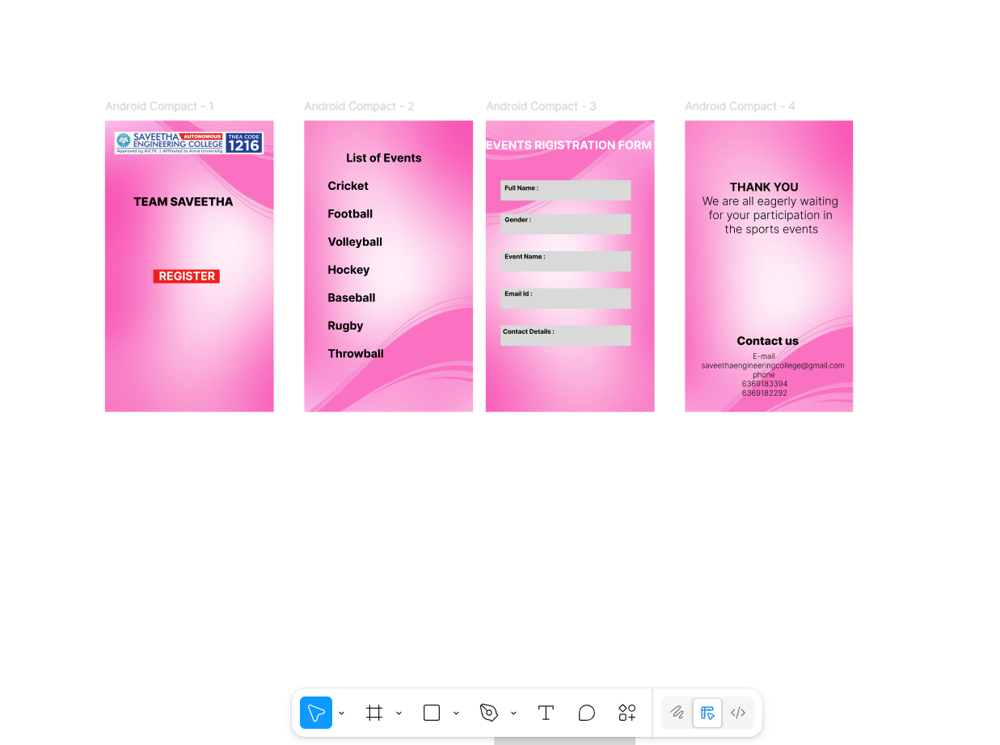

# Ex09 Event Registration Web Application
## Date: 10/11/2025

## AIM:
To design, develop and deploy a web application for event registration.

## DESIGN STEPS:

### Step 1:
Create a new frame.

### Step 2:
Select any one preset size of your choice.

### Step 3:
Select the shapes you need.

### Step 4:
Import images as needed.

### Step 5:
Create pages based on your need and link them.

### Step 6:

Validate the HTML and CSS code.

### Step 6:

Publish the website in the given URL.

## DESIGN TOOL:
Figma

## CODE:
```
Home Page
<div style="width: 700px; height: 840px; position: relative; background: #E0BC97; overflow: hidden">
  
  
  <div style="width: 173px; height: 44px; left: 261px; top: 640px; position: absolute; background: white; box-shadow: 0px 4px 4px rgba(0, 0, 0, 0.25) inset; border-radius: 10px"></div>
  <div style="width: 173px; height: 20px; left: 261px; top: 652px; position: absolute; text-align: center; justify-content: center; display: flex; flex-direction: column; color: black; font-size: 24px; font-family: IM FELL Double Pica SC; font-weight: 400; word-wrap: break-word">LOGIN</div>
  <div style="width: 451px; height: 106px; left: 126px; top: 206px; position: absolute; text-align: center; justify-content: center; display: flex; flex-direction: column; color: white; font-size: 128px; font-family: Jomhuria; font-weight: 400; word-wrap: break-word">TECH-Z</div>
</div>

PAGE 2:
<div style="width: 700px; height: 840px; position: relative; background: #07368C; overflow: hidden">
  <div style="width: 404px; height: 77px; left: 148px; top: 38px; position: absolute; text-align: center; justify-content: center; display: flex; flex-direction: column; color: white; font-size: 96px; font-family: Jomhuria; font-weight: 400; word-wrap: break-word">LIST OF EVENTS</div>
  <div style="width: 623px; height: 682px; left: 46px; top: 115px; position: absolute; justify-content: center; display: flex; flex-direction: column"><span style="color: white; font-size: 32px; font-family: Silkscreen; font-weight: 400; word-wrap: break-word">TechOrbit  :  “Beyond Limits, Beyond Logic”<br/>QuantumX   :  “Think. Tweak. Transform.”<br/>NextGenZ  :   “The Future is Now”<br/>CyberNova   :  “A Starburst of Innovation”<br/>TechAstra  :   “Aim Beyond Infinity”<br/>   FusionZ   : “ Where Energy Meets Technology</span><span style="color: white; font-size: 32px; font-family: Suravaram; font-weight: 400; word-wrap: break-word">”</span></div>
  
</div>

PAGE 3:

<div style="width: 700px; height: 840px; position: relative; background: #172283; overflow: hidden">
  <div style="width: 634px; height: 113px; left: 33px; top: 21px; position: absolute; justify-content: center; display: flex; flex-direction: column; color: white; font-size: 96px; font-family: Jomhuria; font-weight: 400; word-wrap: break-word">EVENT REGISTRATION FORM</div>
  <div style="width: 549px; height: 53px; left: 66px; top: 183px; position: absolute; background: white; border-radius: 20px"></div>
  <div style="width: 500px; height: 55px; left: 100px; top: 180px; position: absolute; justify-content: center; display: flex; flex-direction: column; color: black; font-size: 32px; font-family: Suravaram; font-weight: 400; word-wrap: break-word">FULL NAME: </div>
  <div style="width: 549px; height: 50px; left: 66px; top: 278px; position: absolute; background: #D9D9D9; border-radius: 20px"></div>
  <div style="width: 500px; height: 86px; left: 100px; top: 259px; position: absolute; justify-content: center; display: flex; flex-direction: column; color: black; font-size: 32px; font-family: Suravaram; font-weight: 400; word-wrap: break-word">REGISTER NO.:</div>
  <div style="width: 549px; height: 52px; left: 66px; top: 368px; position: absolute; background: #D9D9D9; border-radius: 20px"></div>
  <div style="width: 241px; height: 52px; left: 100px; top: 368px; position: absolute; justify-content: center; display: flex; flex-direction: column; color: black; font-size: 32px; font-family: Suravaram; font-weight: 400; word-wrap: break-word">EVENT NAME:</div>
  <div style="width: 549px; height: 53px; left: 68px; top: 460px; position: absolute; background: #D9D9D9; border-radius: 20px"></div>
  <div style="width: 481px; height: 53px; left: 100px; top: 460px; position: absolute; justify-content: center; display: flex; flex-direction: column; color: black; font-size: 32px; font-family: Suravaram; font-weight: 400; word-wrap: break-word">EMAIL ID:</div>
  <div style="width: 549px; height: 48px; left: 68px; top: 553px; position: absolute; background: #D9D9D9; border-radius: 20px"></div>
  <div style="width: 481px; height: 28px; left: 100px; top: 563px; position: absolute; justify-content: center; display: flex; flex-direction: column; color: black; font-size: 32px; font-family: Suravaram; font-weight: 400; word-wrap: break-word">CONTACT NO.:</div>
  
</div>

PAGE 4:
<div style="width: 700px; height: 840px; position: relative; background: #19138A; overflow: hidden">
  <div style="width: 673px; height: 199px; left: 37px; top: -21px; position: absolute; justify-content: center; display: flex; flex-direction: column; color: white; font-size: 96px; font-family: Jomhuria; font-weight: 400; word-wrap: break-word">REGISTRATION CONFIRMED!</div>
  <div style="width: 599px; height: 514px; left: 50px; top: 163px; position: absolute; text-align: center; justify-content: center; display: flex; flex-direction: column; color: white; font-size: 40px; font-family: Suravaram; font-weight: 400; word-wrap: break-word">Thank you for joining Tech-Z 2025 — a world where technology meets creativity. We’re excited to see you at the event. Stay tuned for further updates in your mail!</div>
  
</div>


```
## OUTPUT:



## RESULT:
The program to design, develop and deploy a web application for event registration is completed successfully.
